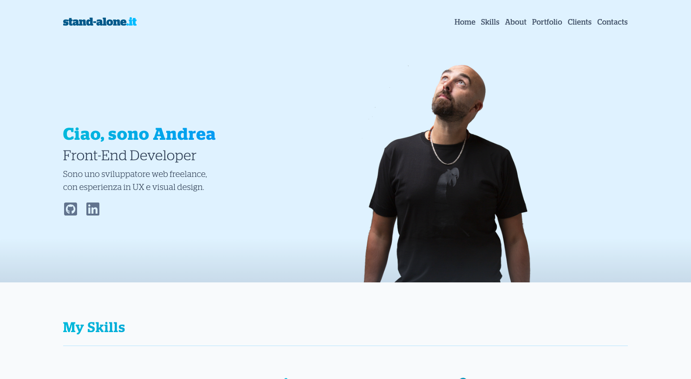

# 🌐 stand-alone Portfolio Website

A personal portfolio website built with **React**, **Vite**, and **Tailwind CSS**, showcasing my skills, projects, and client collaborations.  
Deployed on **Netlify** with custom domain [stand-alone.it](https://stand-alone.it).

---

## 🚀 Tech Stack

- ⚛️ **React (Vite)** – fast and modern frontend build setup
- 🎨 **Tailwind CSS** – utility-first styling for rapid development
- 🎞 **Swiper.js** – responsive sliders and carousels
- ✨ **AOS (Animate On Scroll)** – smooth scroll animations
- 🌐 **Netlify** – hosting and continuous deployment

---

## 📂 Features

- Responsive, accessible layout
- Sticky, glass-effect navigation bar with mobile hamburger menu
- Animated sections with progressive delay
- Projects slider with progressbar pagination
- Gradient overlays and hover effects on images
- Custom favicon and domain setup

---

## 📸 Preview



_(replace `screenshot.png` with an actual image of your project in the repo)_

---

## ⚡ Setup & Development

Clone the repo and install dependencies:

```bash
git clone https://github.com/YOUR-USERNAME/stand-alone-portfolio.git
cd stand-alone-portfolio
npm install
npm run dev
```
